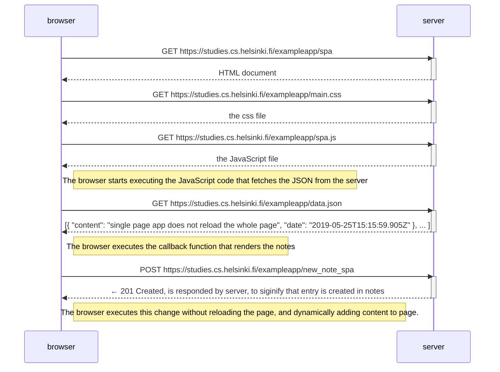

```mermaid
sequenceDiagram
    participant browser
    participant server

    browser->>server: GET https://studies.cs.helsinki.fi/exampleapp/spa
    activate server
    server-->>browser: HTML document
    deactivate server

    browser->>server: GET https://studies.cs.helsinki.fi/exampleapp/main.css
    activate server
    server-->>browser: the css file
    deactivate server

    browser->>server: GET https://studies.cs.helsinki.fi/exampleapp/spa.js
    activate server
    server-->>browser: the JavaScript file
    deactivate server

    Note right of browser: The browser starts executing the JavaScript code that fetches the JSON from the server

    browser->>server: GET https://studies.cs.helsinki.fi/exampleapp/data.json
    activate server
    server-->>browser: [{ "content": "single page app does not reload the whole page", "date": "2019-05-25T15:15:59.905Z" }, ... ]
    deactivate server

    Note right of browser: The browser executes the callback function that renders the notes

    %% Same as the chain of events caused by opening the page https://studies.cs.helsinki.fi/exampleapp/spa until here

    browser->>server: POST https://studies.cs.helsinki.fi/exampleapp/new_note_spa
    activate server
    server-->>browser: ← 201 Created, is responded by server, to siginify that entry is created in notes
    deactivate server

    Note right of browser: The browser executes this change without reloading the page, and dynamically adding content to page.
```